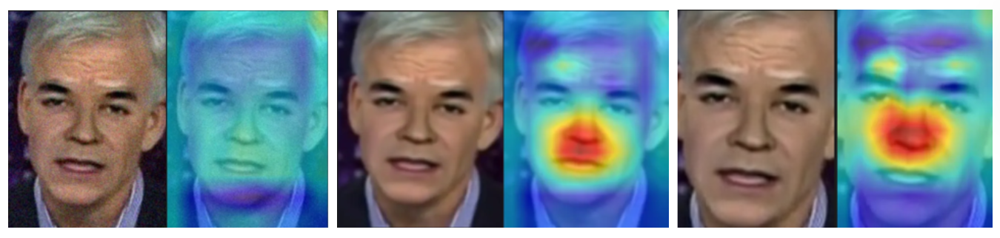

# PyDeepFakeDet Reproduction and Robustness Test

This repository reproduces the M2TR model from the paper [M2TR: Multi-modal Multi-scale Transformer for Deepfake Detection](https://arxiv.org/abs/2104.09770), based on the official implementation [wdrink/PyDeepFakeDet](https://github.com/wdrink/PyDeepFakeDet), and further explores the robustness of the model under common image perturbations.

We also include comparative results with the Xception model and document our attempts with LSDA.

> **Dataset**: FaceForensics++ (FF++) subset  c23
> **Models**: M2TR (main), Xception (baseline)

---

## Summary

- Reproduced the M2TR model using official pre-trained weights.
- Evaluated robustness against Gaussian noise, blur, rotation, and cropping.
- Compared results to the Xception baseline.
- Observed significant robustness gaps in M2TR, especially to Gaussian noise and rotation.
- Grad-CAM was used for visualization.

---

## Experimental Setup

- **Repository Used**: https://github.com/wdrink/PyDeepFakeDet  
- **Dataset**: FaceForensics++ (c23 only, partial samples)  
- **Metrics**: AUC, Accuracy  
- **Visualization Tool**: Grad-CAM  
- **Environment**: ``pip install -r requirements.txt``
- **Perturbations**:
  - Gaussian Noise
  - Gaussian Blur
  - Rotation (90°, 180°, 270°)
  - Cropping

---

## ✅ Reproduction Results (M2TR)

| Metric     | Accuracy | AUC   |
|------------|----------|-------|
| Original   | 90.625   | 0.983 |

The AUC result shown in the paper is 0.9951.

  

Grad-CAM shows attention is focused on nose and mouth areas.

---

## Extended Robustness Experiments

### M2TR Results

| Metric     | Rotation | Noise | Blur  | Crop  |
|------------|----------|-------|-------|-------|
| Accuracy   | 67.708   | 49.375| 60.000| 84.375|
| AUC        | 0.790    | 0.497 | 0.873 | 0.982 |

**Observations:**

- **Gaussian Noise**: Drastic drop in performance.
- **Rotation**: Poor invariance due to fixed positional encoding.
- **Blur**: Though removing high frequency components, it didn't have drastic drop, maybe due to the usage of rgb components.
- **Crop**: Least harmful, possibly due to preserved central features.

  

  

---

### Xception Results

| Metric     | Original | Rotation | Noise | Blur  | Crop  |
|------------|----------|----------|-------|-------|-------|
| Accuracy   | 96.250   | 76.667   | 49.375| 66.875| 95.000|
| AUC        | 0.996    | 0.829    | 0.528 | 0.838 | 0.994 |

---

## AUC Comparison

| Perturbation | M2TR AUC | Xception AUC |
|--------------|----------|---------------|
| Original     | 0.983    | 0.996         |
| Rotation     | 0.790    | 0.829         |
| Noise        | 0.497    | 0.528         |
| Blur         | 0.873    | 0.838         |
| Crop         | 0.982    | 0.994         |

> **Note**: Our results show that Xception consistently outperforms M2TR under perturbations, contrary to the claims in the original M2TR paper. Similar concerns were raised by other users:  
> https://github.com/wdrink/PyDeepFakeDet/issues/9

---

## Critical Reflections

### On M2TR's Robustness

- M2TR heavily relies on high-frequency details.
- Its vulnerability to Gaussian noise contradicts its frequency-domain design.
- Blur affects M2TR less than noise, suggesting robustness is not purely tied to frequency cues.

### On Positional Encoding

- Rotational misalignment degrades Grad-CAM attention.
- Fixed positional embeddings in transformers lead to performance drop under rotation.

---

## References

1. Wang et al., ["M2TR: Multi-modal Multi-scale Transformers for Deepfake Detection"](https://arxiv.org/abs/2104.09770)
2. GitHub Implementation: [wdrink/PyDeepFakeDet](https://github.com/wdrink/PyDeepFakeDet)

---
