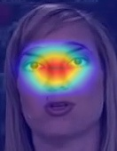

# Visualization Tools

We provide a visualization tool with GradCAM in PyDeepFakeDet, which may facilitate you to better understand the behavior of the pretrained model.


## Gradcam

GradCam[1] is a visual explanations for deep networks via gradient-based localization. It uses the gradients of any target category that flow into the final convolutional layer to produce a coarse localization map highlighting important regions in the image.

## Requirements

* PIL 

* matplotlib

### Prepare

Before running the code, you need prepare 

* the model you want to visualize, placing in the PyDeepFakeDet/models folder.

* the checkpoint of the pretrained model


### Run

Examples: `python visualization/gramdcam.py --model Xception --pth Xception.pth --layer res4 --img demo.jpg --save_path save.jpg`   

args:

```python
python preprocess/extract_frames.py -h
usage: crop.py [-h] -root_dir ROOT_PATH

optional arguments:
  -h, --help            show this help message and exit
  --model,  model name, should be exactly same with the file name in PyDeepFakeDet/models
  --pth,     checkpoint file of the model
  --img,     facial image path
  --save_path,      save activation map path
```


### Result Demo

Origin Image:


Activation Map:



## References

[1] Selvaraju R R, Cogswell M, Das A, et al. Grad-cam: Visual explanations from deep networks via gradient-based localization. in ICCV 2017.
